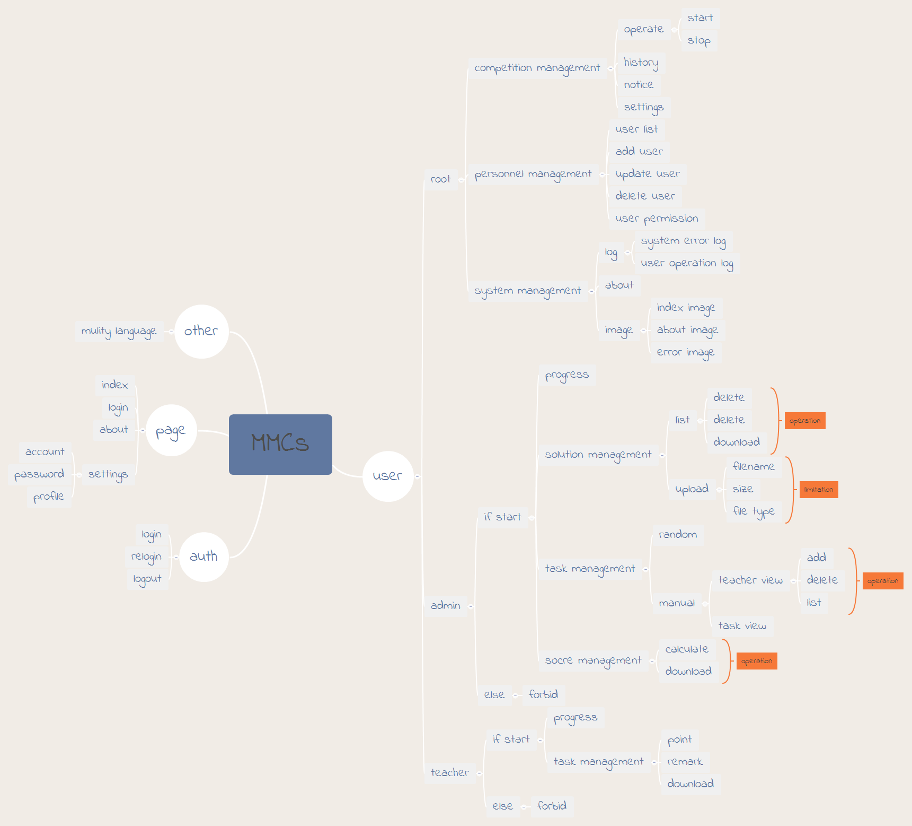

<p align="center"></p>
<p align="center"><a href='docs/DESCRIPTION.md'>[中文说明]</a></p>
<p align="center"><i>NCUST <b>M</b>athematical <b>M</b>odeling <b>C</b>ompetition <b>s</b>ystem</i></p>
<p align="center"></p>

## Installation

```bash
$ git clone https://github.com/Zeroto521/MMCs.git
$ cd MMCs
$ pipenv install --dev
$ pipenv shell
$ flask forge
$ flask translate compile
$ flask run
* Running on http://127.0.0.1:5000/
```

> More details look for [this](docs/INSTALLATION.md).

## Features

<p align="center"></p>

## 中文介绍

## TODO

-   [ ] table sort problem
