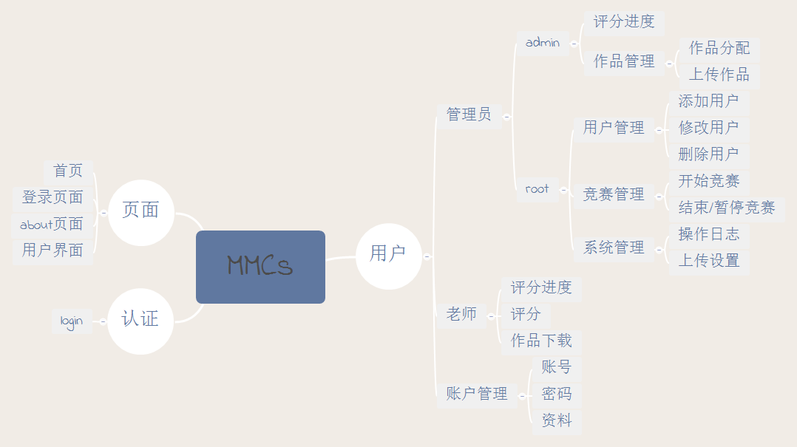

<p align="center"></p>	
<p align="center"><i>NCUST Mathematical Modeling Competition System.</i></p>

## Installation

```bash
$ git clone https://github.com/Zeroto521/MMCs.git
$ cd MMCs
$ pipenv install --dev
$ pipenv shell
$ flask forge
$ flask run
* Running on http://127.0.0.1:5000/
```

## Funtions

<p align="center"></p>

## TODO

-   [ ] 日志，附加邮件发送

### teacher

-   [ ] 修改次数限制
-   [ ] 表格下载功能

### admin

-   [ ] 表格下载功能
-   [ ] 总分功能
-   [ ] 随机分配功能
-   [ ] 表格按题号和序号排序功能
-   [ ] 表格数据显示，None 不显示
-   [ ] 上传限制
-   [ ] 查询

### root

-   [ ] 系统设置
-   [ ] 历史查询
-   [ ] 开始比赛**控制**
